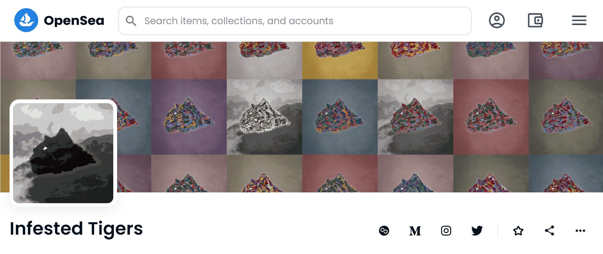

# Infested Tigers

自然与无尽的人类贪婪对抗。

Infested 世界的第一个项目是“Infested Tigers”，由 Infested Mountain 的顶级掠食者组成。它由大约 50 种由韩国纸材料制成的颜色资产组成，在多边形主网上注册了总共 97 种数字艺术。

Infested Tigers 是 97 只独特的老虎的集合，它们统治着被感染的山脉。

所有图片在售罄之前不会发布。因为有稀有性和 6 只独特的老虎。

售罄时，10% 的销售额将捐赠给 WWF。

