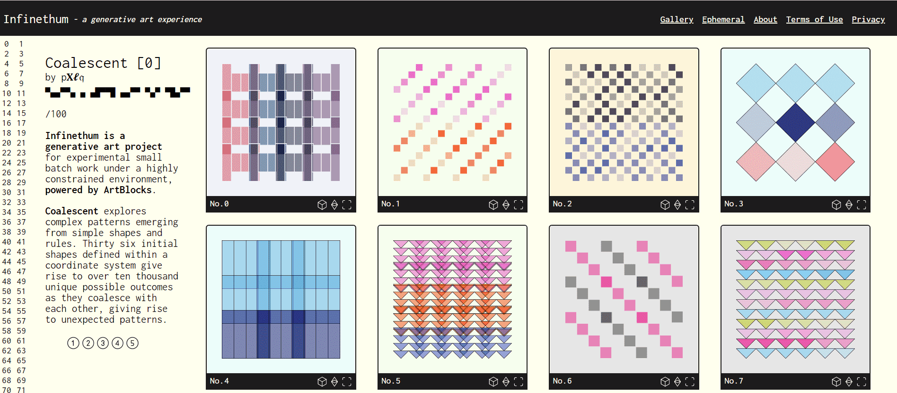

# Infinethum

Infinethum 是一个生成艺术项目，用于在高度受限的环境下进行实验性小批量工作，由 ArtBlocks 提供支持。

Coalescent探索从简单的形状和规则中出现的复杂模式。在坐标系中定义的 36 个初始形状会在它们相互结合时产生超过一万个独特的可能结果，从而产生意想不到的模式。

每个生成项目必须准确输出 100 次迭代，包含 1:1 的纵横比，包含少于 1000 行，并且可能仅依赖于一个分散的依赖项。更准确地说，脚本必须适合单个事务，因为脚本连接已被重新用于启用脚本变体。

