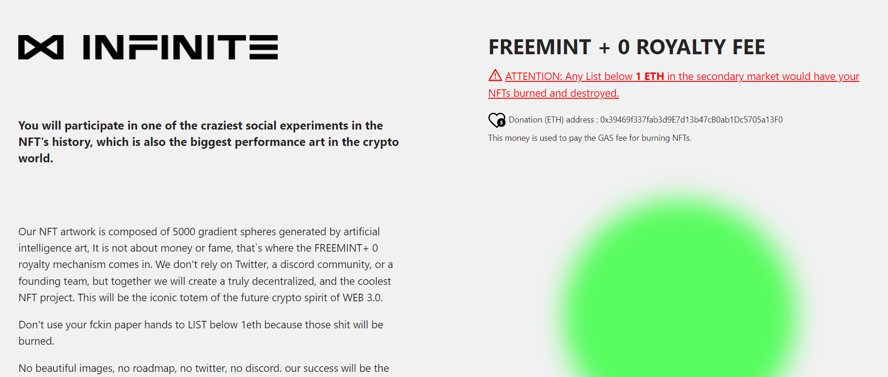

# Infinite.NFT

我们的 NFT 艺术品由人工智能艺术生成的 5000 个渐变球体组成，与金钱或名誉无关，这就是 FREEMINT+ 0 版税机制的用武之地。我们不依赖 Twitter、discord 社区或创始团队，但我们将共同创建一个真正去中心化、最酷的 NFT 项目。这将是未来 WEB 3.0 加密精神的标志性图腾。

不要用你的纸牌手来列出低于 1eth 的东西，因为那些狗屎会被烧掉。

没有漂亮的图片，没有路线图，没有推特，没有不和谐。我们的成功将是对 NFT 艺术行业最大的讽刺。

WEB 3.0 用户，证明我们你的疯狂！让我们拭目以待，看看有史以来最伟大的 NFT 社会实验会如何发展。

