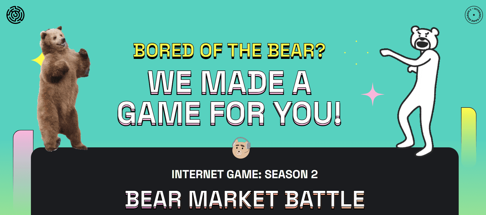

# Internet Game Token

1 薄荷门票玩
8 月 30 日薄荷糖。您的票会跟踪您的排名和分数。您可以选择在大结局前将其出售以“兑现”，或者继续争取大奖。买家继承你的分数+排名。是的，如果您想要更多获胜的机会，您可以铸造多个。

2 60% 的薄荷用于 NFT 奖品
所有有奖 NFT 都是通过我们 Discord 中的社区投票直接选择的。铸币厂之后的一周是不间断的 NFT 购物狂欢。我们已经通过购买 Bored Ape #4317 开始了派对

3  第1 部分：赛前
一周内进行 3 场单人游戏。对于每场比赛，您有 24 小时的时间记录您的最高分，但尝试次数有限。你会根据你的表现获得积分。没有淘汰（还）。

4 第 2 部分：总决赛
3 多人游戏。Gmoney 和 Leah Lamarr 是该节目的主持人。在每场比赛中没有晋级的球员将被淘汰。获胜者根据表现获得积分。

5 获胜者获得奖品
积分排名前列的玩家，每人从奖池中赢得一个 NFT，在分发时按底值顺序排列

