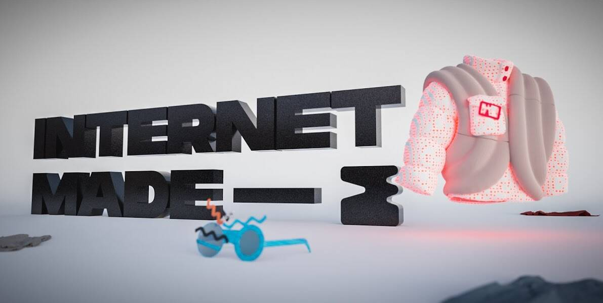

# Internet Made

一个人造时装工作室，将过去的时尚参考与新的数字叙事联系起来，反映了我们成长的数字 Mise-en-scène。Internet Made Genesis NFT - 常见问题（FAQ）
▶ 什么是互联网创世纪？
Internet Made Genesis 是一个 NFT 标记（不可替代）集合。在区块链上的数字收藏品集合。
▶ 存在多少 Internet Made Genesis 代币？
有700个创世纪NT制作的创世纪NFT目前，396个互联网创造了一个网址。
▶最近？多少了 Internet Made
过去 30 个互联网售出 Genesis 0 个 NFT。
▶ 什么是流行的 Internet Made Genesis 替代品？
拥有 Internet Made Genesis NFT 的用户还拥有 Gauntlets、PantherBros、90s Ape Club Original 和 RugBurn。

