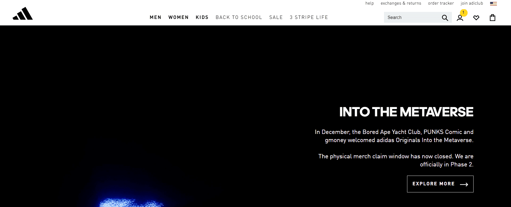

# Into The Metaverse XCOPY

Bored Ape Yacht Club 是以太坊区块链上 10,000 个 Bored Ape NFT 的集合，这些 NFT 已在流行文化中根深蒂固。每个 Bored Ape NFT 都兼作独家俱乐部的会员资格，使所有者能够获得从商品掉落到活动的各种好处。 

作为即将发生的事情的标志，adidas Originals 以我们的第一个 NFT 猿 #8774 加入了无聊的猿游艇俱乐部。 

介绍 Indigo Herz，一位通过心眼看世界的叛逆乐观主义者。他们以社区为中心——我们中的一员——很高兴能在沼泽俱乐部代表阿迪达斯。到时候那里见。

认识朋克！来自 Metaverse 的每个人最喜欢的不合群的收藏家、反叛者和加密货币 degens 又回来了。Courtney 在 NFT 和实体漫画书 PUNKS Comic 中担任主角。 

PUNKS Comic 的诞生是为了通过为心爱的系列提供名称、身体、背景故事和丰富多彩的叙述来将 NFT 带入生活的愿望。

