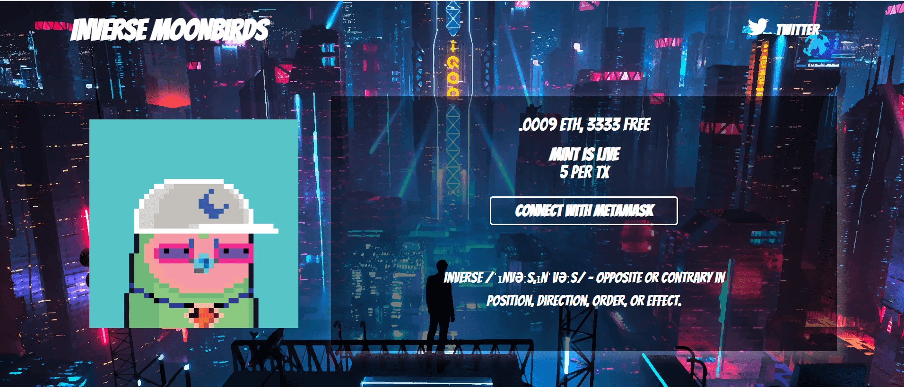

# InverseMoonbirds

InverseMoonbirds 是什么时候创建的？

InverseMoonbirds 于 2022 年 8 月 8 日首次铸造。

有多少个 InverseMoonbirds 代币？

我们目前正在追踪流通中的 2,886 个尚未被销毁或质押的 InverseMoonbirds 代币。

InverseMoonbirds 有多少特征？

我们为 InverseMoonbirds 编制了 72 个独特性状对的索引。

我在哪里可以买到 InverseMoonbirds？

购买 InverseMoonbirds 最常见的地方包括 OpenSea 和 LooksRare 等市场或 Gem.xyz 和 Genie.xyz 等聚合器。链接可以在上面找到！

