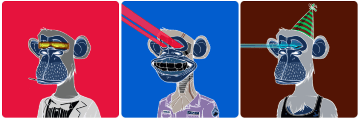

# Inverted Ape Club

[Inverted Ape Club](https://invertedapeclub.com/)是可证明公平的 BAYC 衍生作品。拥有一个 Inverted Ape 可以从 Luego Labs 无限期发布的每个基于以太坊的 Solidity 项目中获得特权。

10K 独特的猿类，倒置。倒立猿只能铸造给它们相应的 BAYC 持有者。1% 的适用二级销售永远归相应的 BAYC 持有人所有。

不隶属于无聊猿游艇俱乐部或 Yuga Labs。倒立猿俱乐部 NFT - 问题常见（FAQ）
▶ 什么是倒立猿俱乐部？
Inverted Ape Club 是一个 NFT（Non-fungible token）集合。在区块链上的数字收藏品存储集合。
▶ Inverted Ape Club 代币有多少？
个猿NT1，87个倒置Ape NFT。目前7位车的钱包中至少有一个倒置猿F。
▶ 最贵的倒立猿俱乐部销售是什么？
制作最贵的倒立猿俱乐部 NFT 是。它于2022-08-01（26天前）以28.1美元的价格售出。
▶ 极端气候有多少个倒立猿？
过去30个卖出Ape Club NFT 5个。

