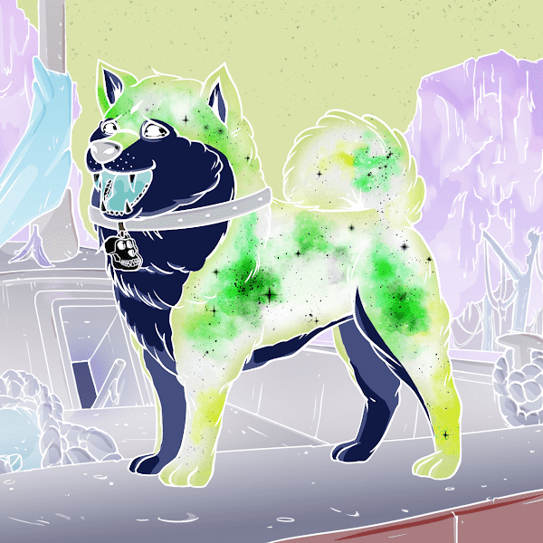

# InvertedInuCoterie

Inverted Ape 替代元节的第一次扩展，Inverted Inu Coterie 是无聊猿养犬俱乐部的可证明公平的衍生产品。适用的二次销售的 1% 给相应的 BAKC 狗持有人，1% 给相应的倒立猿持有人。
因为 BAYC 所有者可以免费铸币，所以我们的路线图里程碑基于收到的捐款。

100% 表示每只可铸币的倒立猿捐赠 0.02 ETH，最大供应量为 10,000。

我们的路线图只达到 75%，因为只有 BAYC 持有者可以铸造，而且他们只能铸造已经拥有的猿的倒置版本。

所有倒置的 Inu Coterie 收益都直接用于原始路线图。- 倒立的 Inus 与 Apes 搭车免费。

