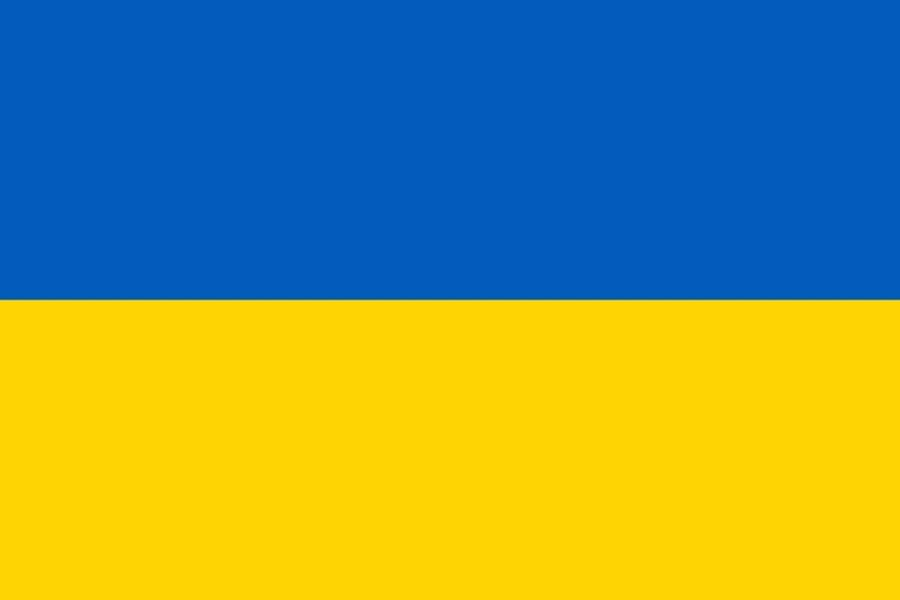

# Invisible Mfers from Ukraine

正如 Sartoshi 所说，“没有国王、统治者或明确的路线图——mfer 可以用这些 mfer 构建他们能想到的任何东西”。

在阅读了这些台词之后，我和我最好的朋友决定为所有在 mfers 中的坏蛋建立这个项目。通过我们的网络，我们将提升和支持乌克兰空间的人们。问题来自乌克兰 NFT 的隐形 Mfer - 常见问题 (FAQ)
▶ 什么是来自乌克兰的隐形Mfer？
来自乌克兰的 Invisible Mfers 是一个 NFT（非同质代存储币）集合。在区块链上的数字收藏品集合。
▶ 有多少来自乌克兰代币的隐形Mfer？
2位有一个隐形Mfer。目前车主的钱包中至少有一个来自NFT的隐形Mfer。
▶ 最近看到了多少来自最近的M？
过去 30 款来自 MFT 的 0 款隐形女鞋。

