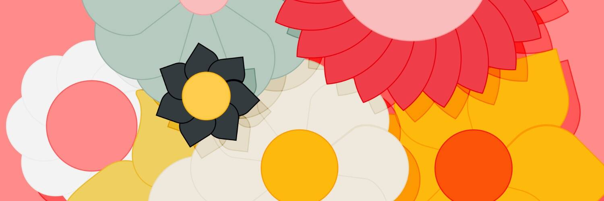

# Flowers On Chain

所有的花都从花店铸造并送到各自的地址 🌺 如果业主决定在二级花店出售他们的花，你仍然可以获得它们

OCC#1 🌺 Flowers 是 4096 个以编程方式生成的链上花朵的集合，供您拥有或分享。每朵花都是 100% 在链上生成的，包括它的元数据。没有 ipfs/arweave，没有外部渲染脚本。只是合同创建的 SVG。

我们是花店，这是一家花店。购买您喜欢、欣赏和引起共鸣的艺术品。但是如果你在乎的话，occ#1 中的 1 是有原因的。

