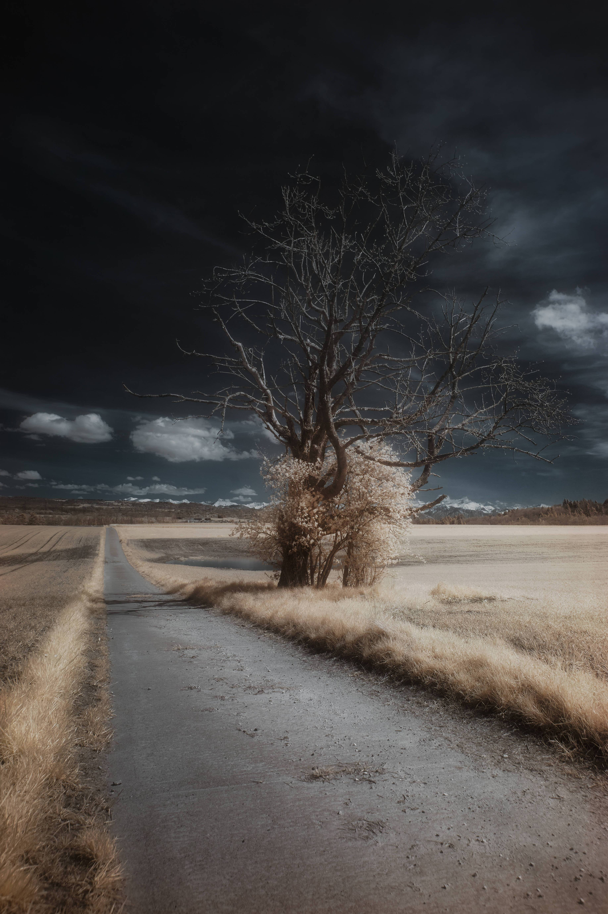

# 1R 7R335 - The Dynamics

从我记事起，我就一直喜欢创造……希望以不同的方式做事，寻找新的想法，使用相机的新方法。

这个系列完全是关于我的……我想捕捉无形的东西，向世界展示他们永远比我们看到的更重要，每个人背后总有一个故事，每一次胜利，每一次奋斗……

在 2022 年 3 月 1 日获得我的第一个红外滤光片后，我爱上了这项技术。这与我作为一名艺术家想要实现的目标产生了强烈的共鸣！我必须超越我所看到的，揭示无形的，揭示另一个视角，揭示……另一个世界。

作为观众，我为你寻找一种方法来做同样的练习。您可能注意到了，但标题有数字而不是一些字母。这被称为 Leet 语言，要阅读它，你必须超越你所看到的！

