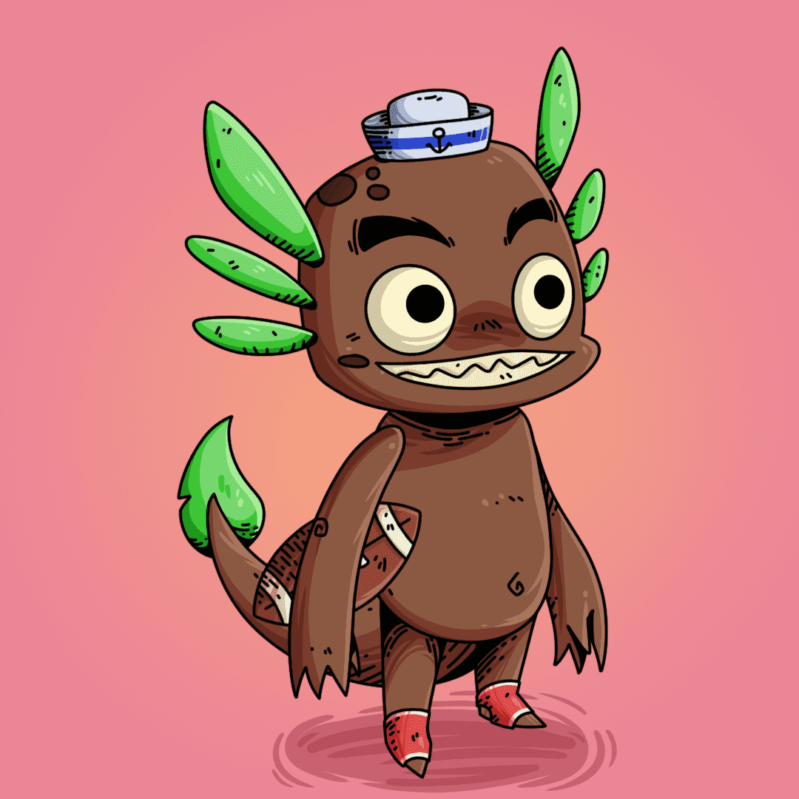

# iSeaMonsters

iSea Monsters 是一个健康 NFT 集合，包含 8,888 个随机生成的怪物，可以与人类一起玩耍和训练。他们的目标是帮助社区过上更好、更健康的生活。iSea Monsters 是第一款将现实世界活动与元宇宙连接起来的健康游戏。当您在现实世界中训练时，您的怪物会在元宇宙中升级，并可以使用这些技能与其他怪物竞争。虽然您的健康数据用于提高怪物的健康，但您仍然是它的 100% 所有者。

