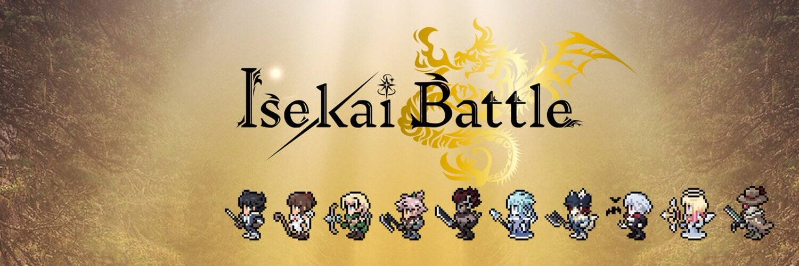

# Isekai Saga Early Participation Gift

“伊势海传奇”的早期参与礼物。收集它们，可能会有好事发生！

“Isekai Saga”是一款完全链上的游戏，玩家在其中争夺碎片（NFT）。当一系列碎片（NFT）完成后，失去的众神之力将被释放，让玩家获得SIN代币（ERC20）。

Isekai Saga Early Participation Gift NFT 在过去 7 天内售出 3 次。Isekai Saga Early Participation Gift 的总销售额为 9.88 美元。Isekai Saga 早期参与礼物 NFT 的平均价格为 3.3 美元。Isekai Saga 早期参与礼物拥有者 7,381 人，总供应量为 10,000 个。

