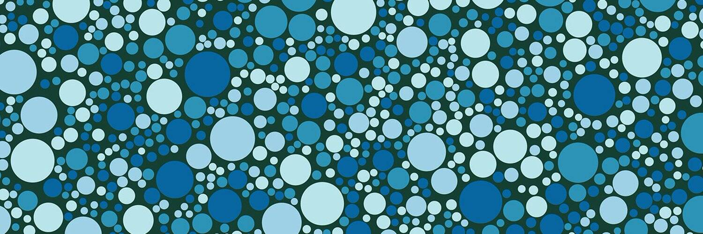

# Ishihara Plates

“Ishihara Plates”是一个 NFT 系列，与传统的模拟 Ishihara 颜色测试平行运行：将功能实用程序提炼成具有自身艺术价值的物体。所有 Ishihara Plates 都是通过生成脚本和手工选择的美学特性创建的。

Ishihara 颜色测试是 20 世纪初的颜色感知测试，旨在识别测试对象视力中的红绿色缺陷。许多人发现石原盘在美学上令人愉悦，无论其功能用途如何。因此，Ishihara Plate NFT 与模拟 Ishihara 颜色测试并行运行：将功能实用程序提炼成具有自身艺术价值的物体。

