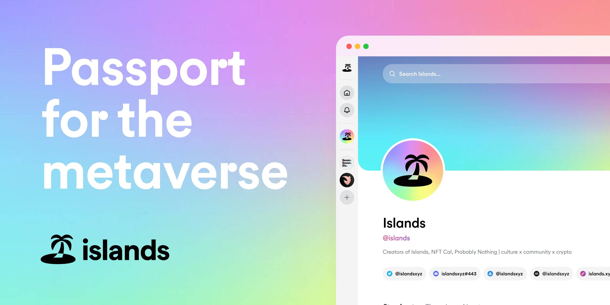

# Islands Welcome Pass

此 NFT 授予您访问 Islands 社区的权限。在官网注册并链接您的钱包后，您将获得这个免费的 NFT 空投，允许您加入 Islands 社区页面上的对话。来到 Islands Life 并加入 web3 中最好的社区。

▶ 什么是离岛欢迎通行证？
Islands Welcome Pass 是一个 NFT（非同质代币）集合。存储在区块链上的数字艺术品集合。
▶ 有多少个岛屿欢迎通行证代币？
总共有 59,674 个岛屿欢迎通行证 NFT。目前，58,715 位车主的钱包中至少有一张 Islands Welcome Pass NTF。
▶ 最昂贵的岛屿欢迎通行证销售是什么？
售出的最昂贵的 Islands Welcome Pass NFT 是 Islands Welcome Pass #127704。它于 2022-06-08（3 个月前）以 5 美元的价格售出。
▶ 最近卖出了多少张海岛欢迎通行证？
过去 30 天内售出了 1 个 Islands Welcome Pass NFT。

