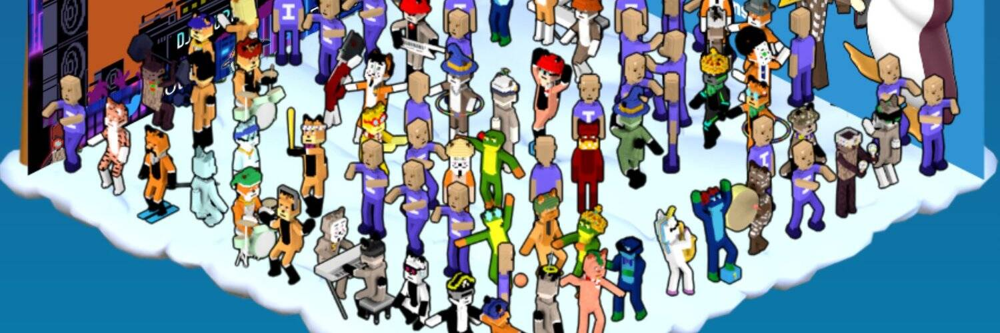

# isotile Genesis LAND

isotile 是一个基于以太坊区块链的去中心化在线虚拟世界，您可以在其中创建您的画廊房间来放置您的 NFT 并结识新的加密朋友！

Genesis Avatars NFT将只有9,000 个。
每个化身在等位元宇宙中都有特殊的特征和行为。
有 4 种按稀有度排序：独角兽、猫头鹰、青蛙和狐狸。
这是第一个拥有稀有“动作”的 NFT 合集，例如您可以在元宇宙中使用的“金电吉他” 。
第一个可用的虚拟现实NFT 集合。

我们是第一个拥有交互式 NFT 的元宇宙。Mooncats 现在可以走进您的在线房间！

