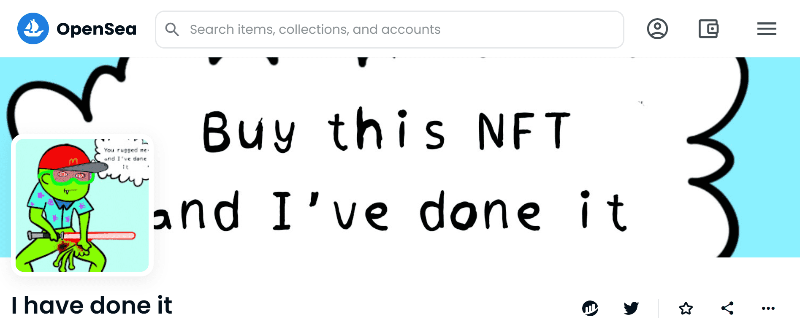

# I have done it

▶ 我做了什么？
我已经完成了它是一个 NFT（不可替代令牌）集合。存储在区块链上的数字艺术品集合。
▶ 我做过多少代币存在？
总共有 1,000 个我完成了 NFT。目前 609 位车主的钱包里至少有一个我做过 NTF。
▶ 我做过的最贵的是什么？
我做过的最贵的 NFT 是 我做过的 #629。它于 2022-06-05（3 个月前）以 3.6 美元的价格售出。
▶ 我做了多少最近卖了？
在过去的 30 天内，我已经完成了 9 个 NFT。
▶ 我做过哪些流行的替代品？
许多拥有我做过 NFT 的用户也拥有 illdoit、 The Walker Apes、 GotRekt？还有 鬼叔。

