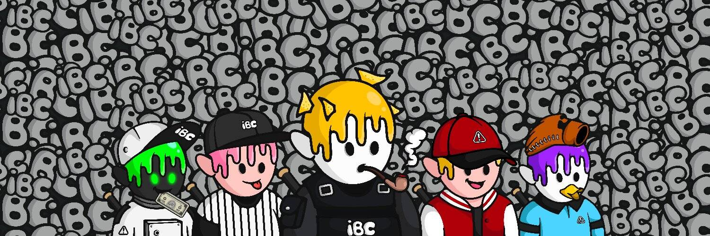

# Ivy Baseball Club V2

常春藤棒球俱乐部是生活在 klaytn 区块链上的 10,000 个独特的 NFT 独特数字收藏品的集合。您的常春藤棒球俱乐部作为您的俱乐部会员卡，并授予会员专属福利、未来区域和福利可以通过激活路线图由社区解锁。它是为了赢得元界联赛而新成立的，并正在为第一场比赛做准备。
我们的团队正在寻找新的前景。 
我们要一起赢得联赛吗？

IBC 是 10,000 个实用程序支持的 PFP 的集合，具有非常多样化和独特的稀有性特征。
持有人可以获得与棒球相关的特殊活动和额外福利，获得
俱乐部会员资格，并参与社区访问和投票。

