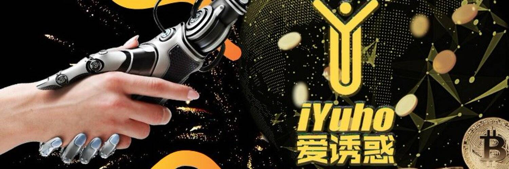

# iYuho AI

iYuho 是一个完整的人工智能 (AI)，可以交易加密货币和外汇。iYuho AI 先进的深度学习算法在每次交易前分析历史定价数据、技术指标和市场情绪。我们与 Binance 合作进行加密交易，与 Avatrade 合作进行外汇交易。我们的移动应用程序“iYuho Plus”可在 Google Playstore 和 Apple Store 购买。

▶ 什么是 iYuho AI？
iYuho AI 是一个 NFT（Non-fungible token）集合。存储在区块链上的数字艺术品集合。
▶ 存在多少 iYuho AI 代币？
总共有 10,000 个 iYuho AI NFT。目前，407 位所有者的钱包中至少有一个 iYuho AI NTF。
▶ 最近卖了多少 iYuho AI？
过去 30 天内售出 0 个 iYuho AI NFT。

