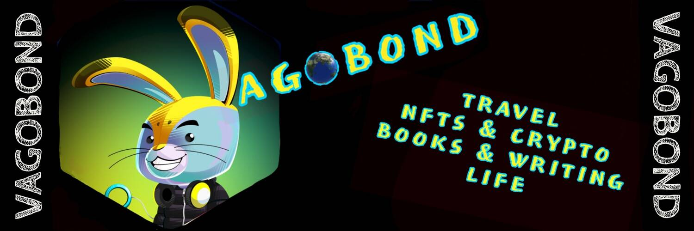

# Izit-a-Bear

10,000 个独特的生成器的集合......熊？伊兹塔熊？是熊市吗？是猫市吗？这是一个海狸市场吗？是吗？我们不知道。我们也不知道这会发生什么。伊兹塔地毯？伊之田百万富翁制造商？

▶ 什么是 Izit-a-Bear？
Izit-a-Bear 是一个 NFT（不可替代代币）集合。存储在区块链上的数字艺术品集合。
▶ 存在多少 Izit-a-Bear 代币？
总共有 9,933 个 Izit-a-Bear NFT。目前，527 位车主的钱包中至少有一个 Izit-a-Bear NTF。
▶ 最近卖出了多少只伊兹特熊？
过去 30 天内售出 0 个 Izit-a-Bear NFT。
▶ 流行的 Izit-a-Bear 替代品有哪些？
许多拥有 Izit-a-Bear NFT 的用户还拥有 OkAI Bearz、 Radioactive Apes（官方）、 DOOMSDAYX Gen 01 Haleek Maul Producer NFT和 Not Okay NFT。

