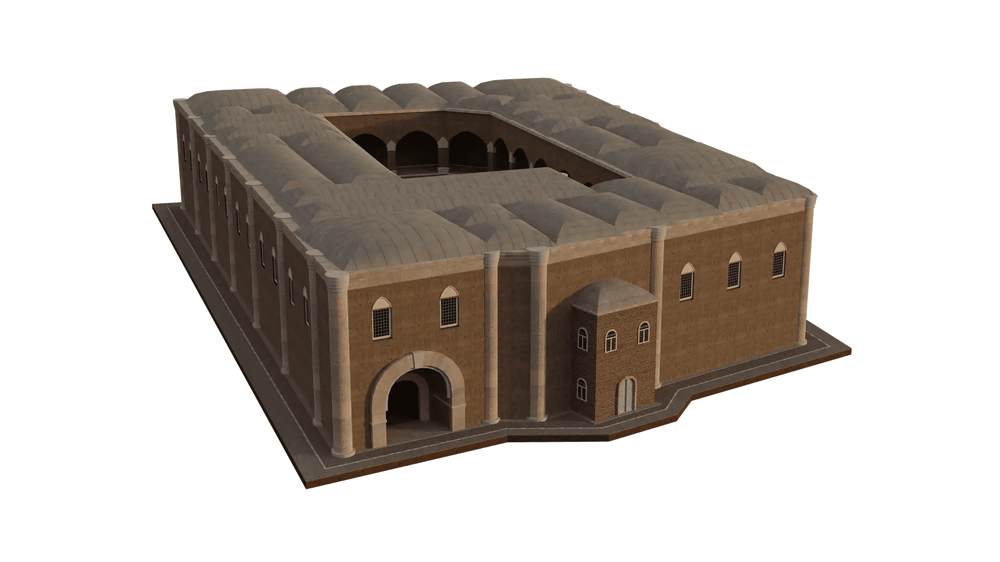

# IZMIR TIME MACHINE GENESIS COLLECTION

伊兹密尔时间机器由伊兹密尔开发署创建，是一个多层次的项目，结合了史前史、古典考古学、艺术史、现代史和建筑史等多个学科，并结合了三维建模、网络技术、摄影、平面设计、和视频制作，以及区块链智能合约。伊兹密尔时间机器项目旨在通过严谨的学术数据从三个维度恢复伊兹密尔数千年的考古和历史遗产，并利用现代网络技术将复兴的内容带到互联网上。IZKA 的 Izmir Time Machine Genesis Collection 在许多方面都是世界首创，是该项目下的独家 NFT 收藏，其中包括由Smyrna Capital制作的 99 个独特的 NFT 。

