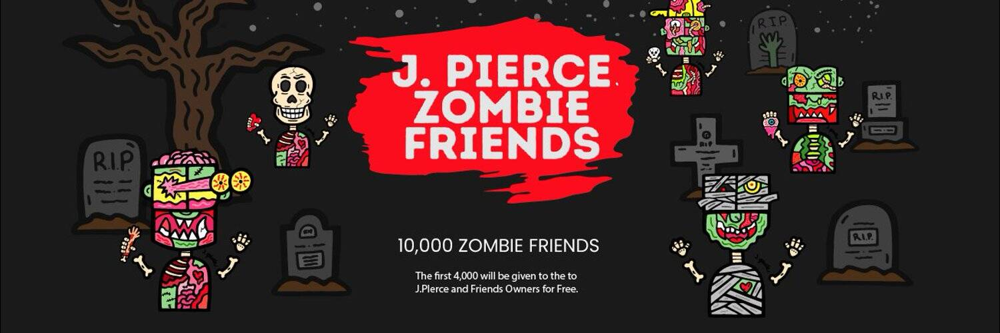

# J. Pierce & Friends

JPierce and Friend”是艺术家贾斯汀·皮尔斯（Justin Pierce）特别精心手绘并签名的新角色系列

著名的美国现代艺术家贾斯汀·皮尔斯 ( Justin Pierce ) 对美术、产品设计和定制城市壁画充满热情，以触动人们和他们的情感。他对颜色和图案的运用使他的作品对年轻人和内心年轻的人都具有独特性和吸引力。

J.Pierce的灵感来自传奇艺术家：沃霍尔、苏斯、哈林和毕加索。他总是从艺术画廊、书籍和流行文化中发现新的见解和艺术视野。贾斯汀以其众多色彩缤纷的绘画、衣服、鞋子、汽车包装和壁画而闻名。他曾出现在国家新闻和吉米金梅尔秀中。

