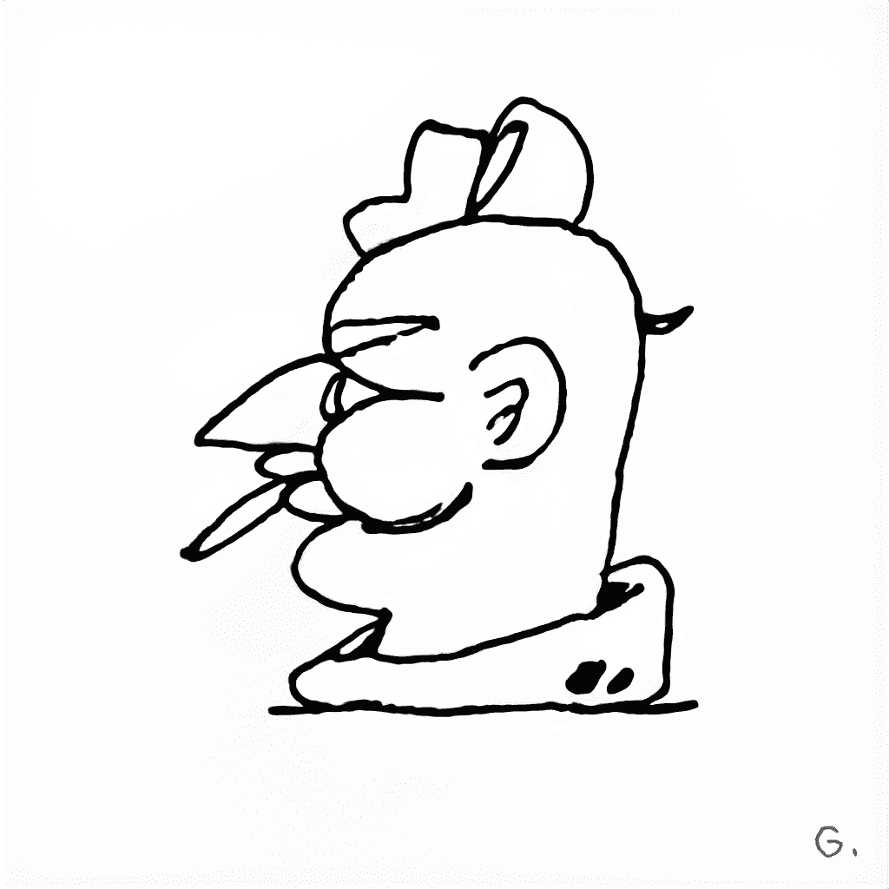

# J48BAFORMS

J48BAFORMS（发音为 Jabbaforms）是以太坊区块链上的多方面艺术实验。该系列包含 4,848 件随机铸造的艺术品。

该项目以艺术家制作的 1000 幅手绘“LEGACYFORMS”作为该系列的基础。在将每个 LEGACYFORM 数字化后，数据集通过我们的 GAN（生成对抗网络）进行处理。在两周的时间里，神经网络学习并解释了原始图纸，从而产生了机器生成的变体，感觉就像是艺术家作品的有机延伸。J48BAFORMS 提供一系列令人兴奋的稀有物品和风格，从原创手绘作品到附有乐谱的动画作品。

