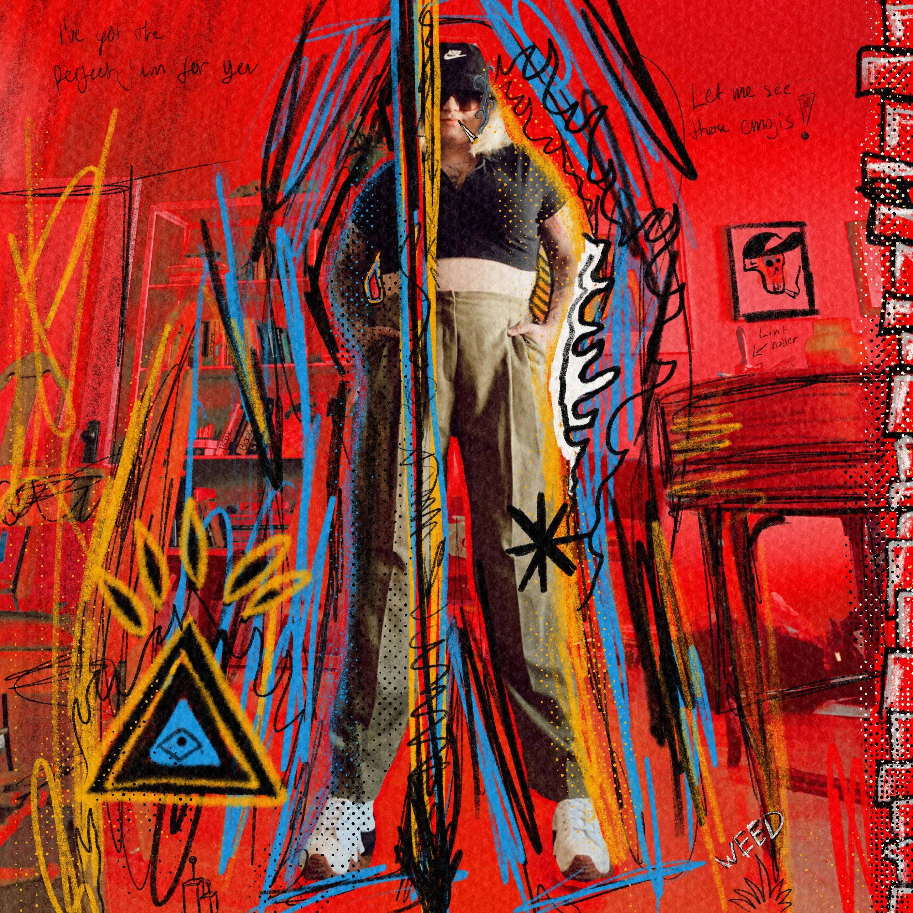

# Jake Zelinger

Jake Zelinger NFT 的 ANTI-POP 在过去 7 天内售出 3 次。Jake Zelinger 的 ANTI-POP 总销售额为 1.27 万美元。Jake Zelinger NFT 的 ANTI-POP 的平均价格为 423.8 美元。Jake Zelinger 拥有 17 个 ANTI-POP，总共拥有 20 个代币。

ANTI-POP 是 Jake Zelinger 的 1/1 表现主义作品的 ERC-721 合同合集。Anti-Pop 是 Zelinger 纯粹艺术表达的出路，同时兼作他的“研发”领域，在那里他尝试可编程 NFT、动态 NFT、生成项目等。

这些目前不提供任何实用程序，并且与史蒂夫收藏或与史蒂夫收藏相关的掉落无关。

