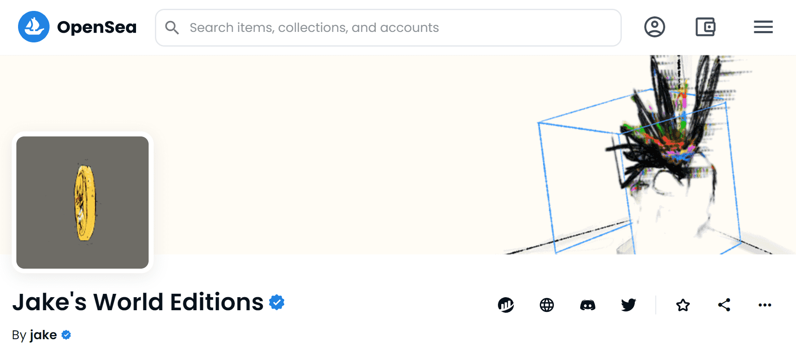

# Jake's World Editions

▶ 什么是杰克的世界版？
Jake's World Editions 是一个 NFT（不可替代代币）系列。存储在区块链上的数字艺术品集合。
▶ 杰克的世界版代币有多少？
总共有 14 个 Jake 的世界版 NFT。目前，286 位所有者的钱包中至少有一个 Jake's World Editions NTF。
▶ Jake's World Editions 最昂贵的销售是什么？
最昂贵的 Jake 世界版 NFT 是 Degen Token。它于 2022 年 8 月 5 日（30 天前）以 1.23 万美元的价格售出。
▶ 最近卖出了多少杰克的世界版？
过去 30 天内售出了 24 个 Jake's World Editions NFT。
▶ 杰克的世界版需要多少钱？
在过去 30 天内，最便宜的 Jake's World Editions NFT 销售额低于 394 美元，最高销售额超过 10400 美元。过去 30 天内，Jake's World Editions NFT 的中位价格为 1054 美元。
▶ 流行的 Jake 世界版替代品有哪些？
许多拥有 Jake's World Editions NFT 的用户还拥有 coupofgrace、 AlphaDoggg Signature Collection、 HOT MESS和 JakNFT ARTBOT Drops。

