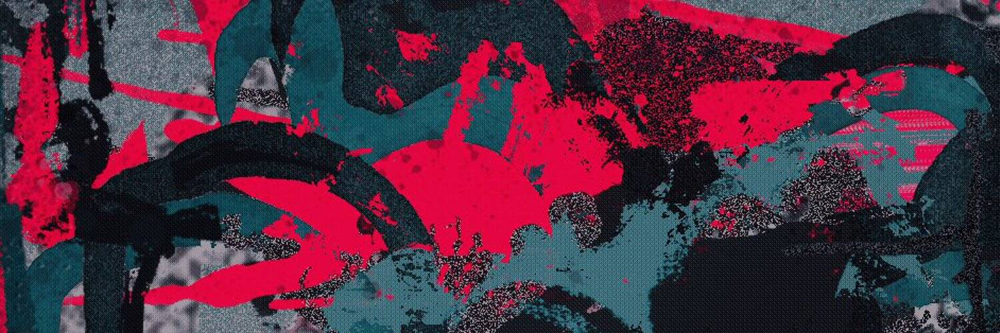

# JakNFT ARTBOT Drops

JakNFT ARTBOT Drops NFT 在过去 7 天内售出 1 次。JakNFT ARTBOT Drops 的总销售额为 384.23 美元。JakNFT ARTBOT Drops NFT 的平均价格为 384.2 美元。共有 132 个 JakNFT ARTBOT Drops 所有者，总共拥有 9 个代币。

对 JakNFT ARTBOT 持有者的独家免费赠品

▶ 什么是 JakNFT ARTBOT Drops？
JakNFT ARTBOT Drops 是一个 NFT（不可替代代币）集合。存储在区块链上的数字艺术品集合。
▶ 有多少 JakNFT ARTBOT Drops 代币？
总共有 9 个 JakNFT ARTBOT Drops NFT。目前，132 位所有者的钱包中至少有一个 JakNFT ARTBOT Drops NTF。
▶ 最昂贵的 JakNFT ARTBOT Drops 促销是什么？
最昂贵的 JakNFT ARTBOT Drops NFT 是 ARTBOT。它于 2022 年 6 月 11 日（3 个月前）以 840 美元的价格售出。
▶ 最近卖出了多少 JakNFT ARTBOT Drops？
过去 30 天内售出了 25 个 JakNFT ARTBOT Drops NFT。
▶ JakNFT ARTBOT Drops 的价格是多少？
在过去 30 天内，最便宜的 JakNFT ARTBOT Drops NFT 销售额低于 217 美元，最高销售额超过 680 美元。JakNFT ARTBOT Drops NFT 的中位价格在过去 30 天内为 455 美元。

