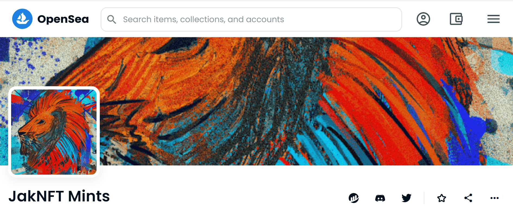

# JakNFT Mints

▶ 什么是 JakNFT 薄荷糖？
JakNFT Mints 是一个 NFT（不可替代代币）集合。存储在区块链上的数字艺术品集合。
▶ 有多少 JakNFT Mints 代币？
总共有 7 个 JakNFT Mints NFT。目前，403 位所有者的钱包中至少有一个 JakNFT Mints NTF。
▶ 最昂贵的 JakNFT 薄荷糖销售是什么？
售出的最昂贵的 JakNFT Mints NFT 是 ROCKETMAN。它于 2022 年 6 月 25 日（2 个月前）以 757.5 美元的价格售出。
▶ 最近卖出了多少 JakNFT 薄荷糖？
过去 30 天内售出了 120 个 JakNFT Mints NFT。
▶ JakNFT 薄荷糖要多少钱？
在过去 30 天内，最便宜的 JakNFT Mints NFT 销售额低于 110 美元，最高销售额超过 134 美元。JakNFT Mints NFT 在过去 30 天内的中位价格为 110 美元。
▶ 有哪些流行的 JakNFT 薄荷糖替代品？
许多拥有 JakNFT Mints NFT 的用户还拥有 JakNFT x Kotegawa的 OG 、 JakNFT ARTBOT Drops、 PS i love you和 niftyjutsu 的 cryptomemento。

