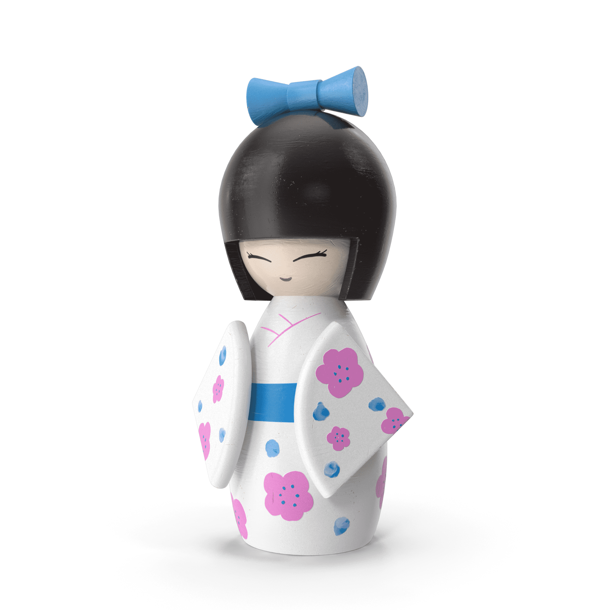

# Japanese Ningyo Dolls

这个高度独家的系列仅包含 6 个手工设计的日本娃娃，由仅被称为“Daisuke”的艺术家制作。这些娃娃与日本的历史密不可分。在日语中被称为“人形”或人形，它们有多种形状和大小，具有无数的意义和象征意义。每个玩偶只会铸造 5 个副本。该系列仅公开发售一次。您的所有权不能被更改、伪造或移除，并且可以在区块链上证明。

▶ 什么是日本人形娃娃？
Japanese Ningyo Dolls 是一个 NFT（非同质代币）系列。存储在区块链上的数字艺术品集合。
▶ 日本人形娃娃代币有多少？
总共有 30 个日本人形玩偶 NFT。目前 9 位所有者的钱包中至少有一个日本人形娃娃 NTF。
▶ 最近卖了多少日本人形娃娃？
过去 30 天内售出 0 个日本人形玩偶 NFT。

