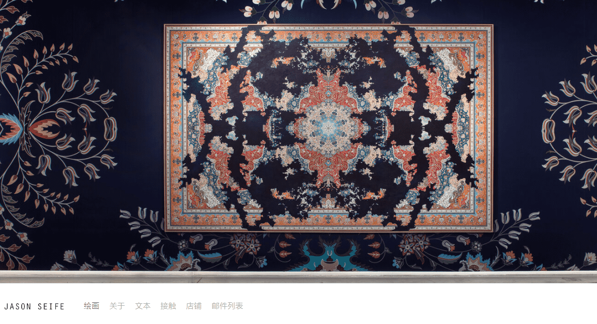

# [ Jason Seife ]

受制裁的核心是一部历时 10 年不断发展的艺术品。关于最严厉经济制裁后果的视觉评论。艺术品将每年更换，以反映生活在这些制裁下的公民必须应对的崩溃、恶化和脆弱性，包括难以获得基本的人类需求、药品和教育。这些制裁的潜在副作用随着时间的推移而显现出来，因为它们不可逆转地改变了后代的社会，因此，这件艺术品也将随着时间的推移而改变，并且永远不会完全恢复到以前的自我。艺术品的逐渐恶化说明了城市的时间性，建筑的崩溃以及人类生存的脆弱性屈服于经济制裁的缓慢窒息。

