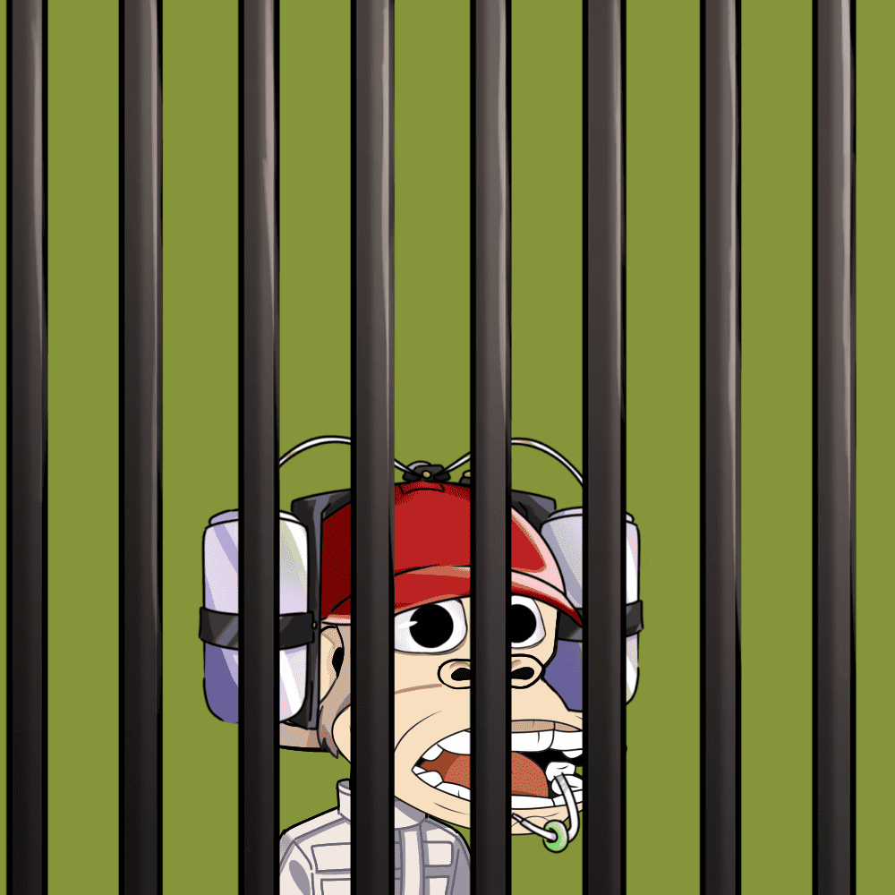

# Jailed Baby Ape Club

Jailed Baby Ape Club NFT 在过去 7 天内售出 4 次。Jailed Baby Ape Club 的总销售额为 25.91 美元。一个 Jailed Baby Ape Club NFT 的平均价格为 6.5 美元。有 3,633 名 Jailed Baby Ape Club 所有者，总共拥有 8,989 个代币。

8,989 JBAC 的集合。为民而生，为民而生。

▶ 什么是监狱婴儿猿俱乐部？
Jailed Baby Ape Club 是一个 NFT（非同质代币）集合。存储在区块链上的数字艺术品集合。
▶ 有多少 Jailed Baby Ape Club 代币？
总共有 8,989 个 Jailed Baby Ape Club NFT。目前，3,633 名所有者的钱包中至少有一个 Jailed Baby Ape Club NTF。
▶ Jailed Baby Ape Club 最贵的拍卖会是什么？
最昂贵的 Jailed Baby Ape Club NFT 是 Jailed Baby Ape Club #999。它于 2022 年 6 月 20 日（2 个月前）以 22 美元的价格售出。
▶ 最近卖了多少监狱婴儿猿俱乐部？
过去 30 天内售出了 21 个 Jailed Baby Ape Club NFT。
▶ 入狱猿猴俱乐部的费用是多少？
过去 30 天，Jailed Baby Ape Club NFT 最便宜的销售额低于 0 美元，最高销售额超过 20 美元。过去 30 天内，Jailed Baby Ape Club NFT 的中位数价格为 4 美元。

