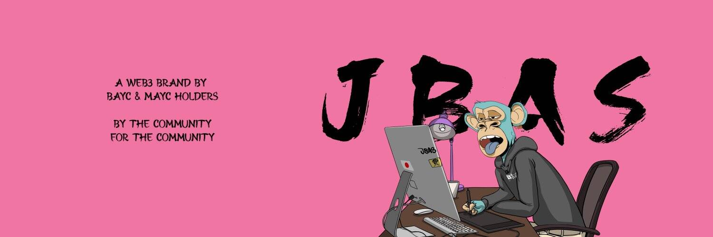

# JBAS Genesis

JBAS 是受日本及其文化启发的 4,457 只猿类的集合。每个 Ape 都将您的会员资格传递给社区，并仅授予会员福利和公用事业的访问权限，其中第一个是访问 TEMPLE。总共将有 9 朵莲花，每朵代表我们去中心化生态系统中的一个专业领域和决策权。领域将因社区基金、商品、未来艺术、收藏品等而异。每个持有者，根据他们持有的花，将被授予对特定事项的投票权。1 猿 + 1 花 = 1 票。OG MONKS 将与其他 BAYC 持有者一起对所有事项拥有投票权。

