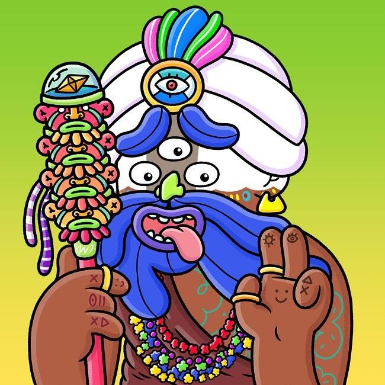

# Shamanzs NFT's

Shamanzs 是以太坊区块链上以编程方式随机生成的 9898 个 NFT 的原始集合。数以百计的特征都是手绘的，以创造出大量高品质和独特的爱心角色。

所有 Shamanz 都遵循 ERC721 NFT 标准。这意味着适应性和耐用性得到了保证。
该团队正在计划一项策略，以在铸造阶段提供尽可能多的分配。
每个 NFT 都将是您通往 Shamaverse 的秘密通行证，它将结合数字和物理世界的实用程序。

创始团队对艺术、科技、音乐和数字世界充满热爱。永远的Frenzs，有着共同的兴趣和抱负，拥有一套独特的技能和人脉，终于与moon Shamanzs联手，将其打造成一个不朽的品牌。

