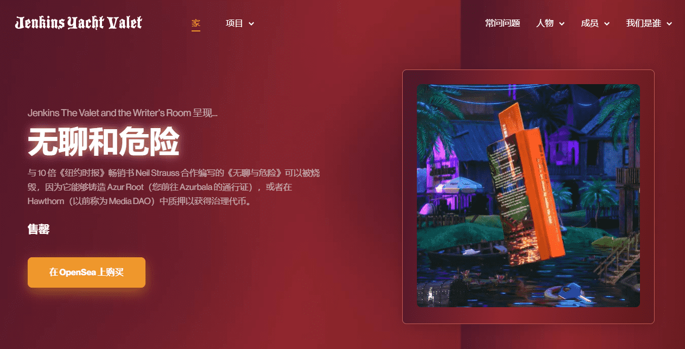

# Jenkins the Valet: The Writer's Room

这些 NFT 解锁了一个仅限会员的 Web3 身份验证门户，以对定义元节的故事行使投票权和创造性指导。用作作家室通行证的 6942 个 NFT 让您有机会将角色授权给故事，对所制作内容的战略和创意方向进行投票，并在每件作品中被铭记为作者和创作者。

无聊和危险与 10 倍《纽约时报》畅销书 Neil Strauss 合作编写的《无聊与危险》可以被烧毁，因为它能够铸造 Azur Root（您前往 Azurbala 的通行证），或者在 Hawthorn（以前称为 Media DAO）中质押以获得治理代币。

