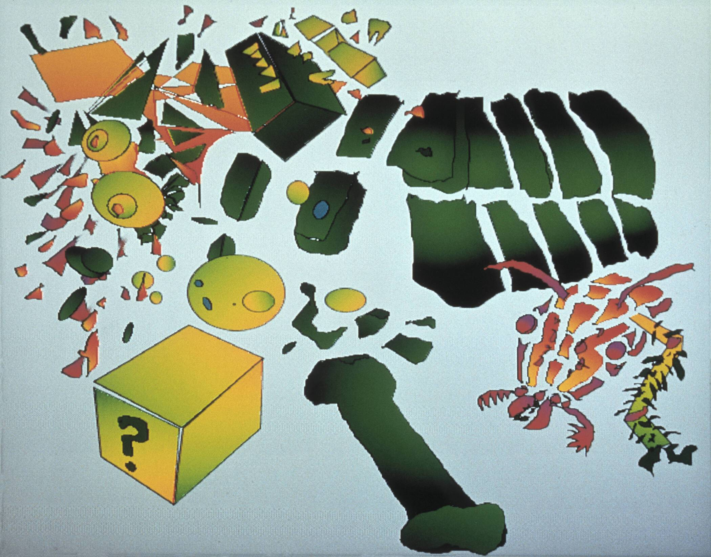

# An Odd Little Place: The Digital Works of Jerry Garcia (1992-1995)

Jerry Garcia 家族与 YellowHeart 合作，展示了“一个奇怪的小地方：Jerry Garcia 的数字作品（1992-1995）”NFT 收藏。作为一名跨越所有媒介的艺术家，Garcia 领先于他的时代，从 1992 年开始，他在他的 Apple Macintosh 电脑上创作了包含在这个系列中的数字艺术作品。这个限量版系列展示了他的 17 件数字作品，跨越了他在这四年中工作的时间。中等的。此次拍卖的部分收益将捐赠给荒野协会。

▶ 什么是一个奇怪的小地方：杰里·加西亚 (1992-1995) 的数字作品？
一个奇怪的小地方：杰里·加西亚（1992-1995）的数字作品是一个 NFT（不可替代令牌）集合。存储在区块链上的数字艺术品集合。
▶ An Odd Little Place: The Digital Works of Jerry Garcia (1992-1995) 代币有多少？
总共有 365 个奇怪的小地方：杰里·加西亚 (1992-1995) 的数字作品 NFT。目前，171 位所有者的钱包中至少有一个 An Odd Little Place: The Digital Works of Jerry Garcia (1992-1995) NTF。

