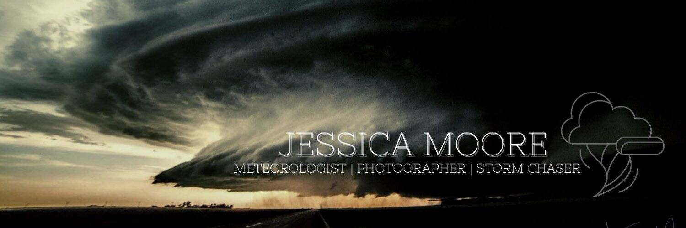

# Jessica Moore Editions

欢迎来到我的极端天气摄影博客和网站！请访问我的“关于我”页面以获取我的简历，并关注我的社交媒体帐户以获取更多照片、直播视频和相关内容！  

我是科罗拉多州科罗拉多斯普林斯市的气象学家和专业摄影师。我是这个美丽的州的土生土长的人，并且从小就经历了相当多的戏剧性和令人兴奋的天气，这激发了我用相机捕捉它的热情。后来这导致了学习天气背后的科学的愿望，所以我最初在丹佛城市州立大学攻读了气象学的大学学位，但后来转到密西西比州立大学完成我的学位（现为广播与运营气象学）。

