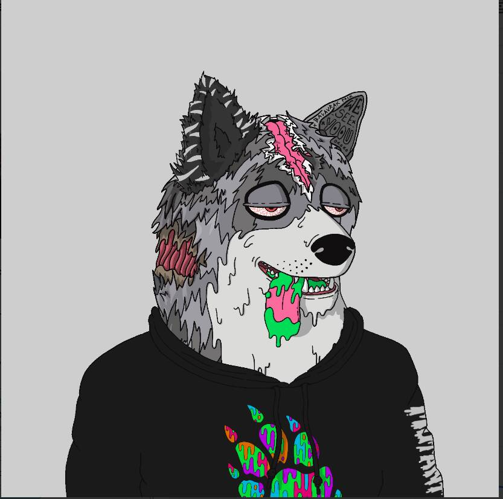

# Mutant Shiba Club

变种人芝俱乐部 | MSC NFT 在过去 7 天内售出 160 次。Mutant Shiba Club的总销量| MSC 为 12.55 万美元。1个变异柴俱乐部的均价| MSC NFT 为 78.5 美元。有 4,691 突变芝巴俱乐部 | MSC 所有者，拥有 10,000 个代币的总供应量。

Mutant Shiba Club 是 10,000 个动画 NFT 的集合。每个 NFT 都是独一无二的，并且驻留在以太坊区块链上。您的 Mutant Shiba Club NFT 将成为您的俱乐部会员资格的两倍。

▶ 什么是变异柴俱乐部| MSC？
变种人芝俱乐部 | MSC 是一个 NFT（Non-fungible token）集合。存储在区块链上的数字艺术品集合。
▶ 多少突变芝俱乐部 | MSC代币存在吗？
总共有10,000个突变Shiba俱乐部| MSC NFT。目前 4,691 位车主至少拥有一个 Mutant Shiba Club | MSC NTF 在他们的钱包里。
▶ 什么是最贵的变种人柴犬俱乐部 | MSC出售？
最贵的变种柴俱乐部| 出售的 MSC NFT 是 Mutant Shiba。它于 2022 年 6 月 25 日（2 个月前）以 337 美元的价格售出。
▶ 多少突变芝俱乐部 | MSC最近卖了？
有894个变异柴犬俱乐部| 过去 30 天内售出的 MSC NFT。
▶ 一个变种人柴俱乐部多少钱| MSC费用？
近30天最便宜的变种柴俱乐部| MSC NFT 销售额低于 54 美元，最高销售额超过 127 美元。Mutant Shiba Club 的中位价 | MSC NFT 在过去 30 天内为 87 美元。

