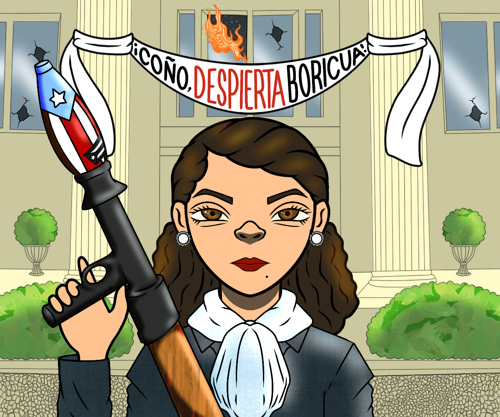

# Jibaro Drops

Jíbaro 掉落 es una collaboración del colectivo de Jibaros NFT，您可以在其中找到 Jíbaros 持有者的独特作品。 Jíbaros NFT 集合由 10,000 个独特的 NFT 组成。 Los Jíbaros 是随机生成的，具有波多黎各文化的特征和本土表达。

Jíbaros 是第一个受文化启发的生成艺术项目——我们称之为“文化影响生成系列”或 CIGS。

由屡获殊荣的团队在波多黎各举办的首个 72 小时元界黑客马拉松中由心打造。

Jíbaros 专注于波多黎各流行文化中固有的 120 种独特资产，这些资产通过我们的算法创建随机 PFP 化身

