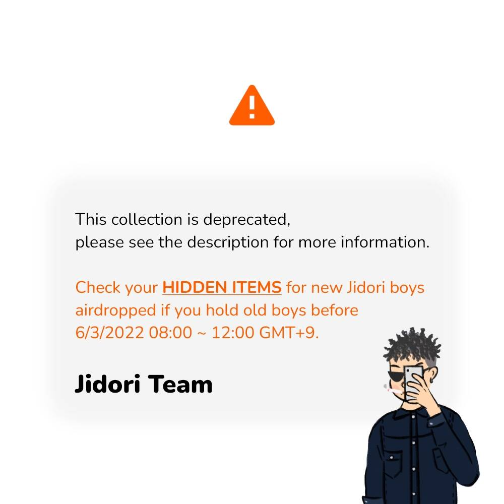

# Jidori Boys

此集合已弃用，请参阅资产说明以查看更多信息。如果您在 2022 年 6 月 3 日 0800 GMT +9 之前持有老男孩，请检查您的隐藏物品是否有新的 Jidori 男孩空投。

空投（新男孩）将于 6/3 08:00 ~ 12:00 GMT+9 进行，具体取决于gas费。一旦天然气价格合理，该程序将继续进行。

▶ 什么是 Jidori Boys（已弃用）？
Jidori Boys（已弃用）是一个 NFT（不可替代令牌）集合。存储在区块链上的数字艺术品集合。
▶ 存在多少个 Jidori Boys（已弃用）代币？
总共有 1,871 个 Jidori Boys（已弃用）NFT。目前，499 位所有者的钱包中至少有一个 Jidori Boys（已弃用）NTF。
▶ 最近卖出了多少个 Jidori Boys（已弃用）？
过去 30 天内售出 0 个 Jidori Boys（已弃用）NFT。

