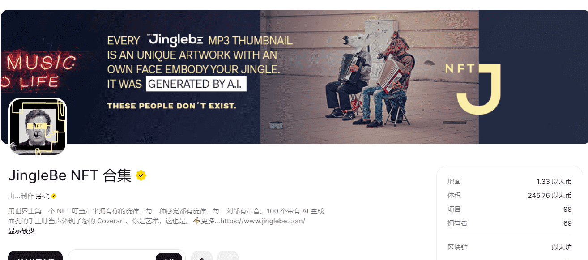

# JingleBe NFT COLLECTION

JingleBe 是您的第二个由音乐制成的皮肤，它带有由 AI 生成的独特艺术品和面孔。这些人不存在。每个 JingeBe 都是由两位充满爱意的音乐家制作的，并带有作为 IPFS Hash 的高质量 wav 和歌曲的完全所有权。你是艺术，这也是。JingleBe NFT COLLECTION 于 2021 年 3 月 1 日首次铸造。我们目前正在追踪流通中的 101 个 JingleBe NFT COLLECTION 代币，这些代币尚未被销毁或质押。购买 JingleBe NFT COLLECTION 最常见的地方包括 OpenSea 和 LooksRare 等市场或 Gem.xyz 和 Genie.xyz 等聚合器。链接可以在上面找到！

