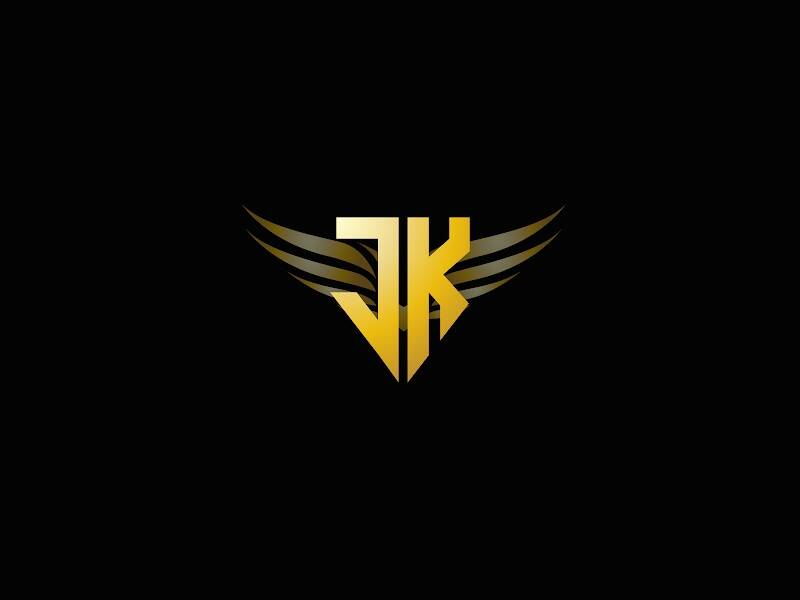

# JK DAO

**JK DAO 统计**

创建于 10 个月前，1 代币供应，10% 费用

过去 7 天没有出售 JK DAO。

每个 NFT 都授予对独家 JK DAO 社区的访问权限以及对 DAO 资产的投票权。

JK DAO NFT - 常见问题（FAQ）
▶ 什么是 JK DAO？
JK DAO 是一个 NFT（Non-fungible token）集合。存储在区块链上的数字艺术品集合。
▶ 有多少 JK DAO 代币？
总共有 1 个 JK DAO NFT。目前 554 位所有者的钱包中至少有一个 JK DAO NTF。
▶ 最昂贵的 JK DAO 销售是什么？
最昂贵的 JK DAO NFT 是 JK KeyCard。它于 2022-08-03（24 天前）以 12.2 美元的价格售出。
▶ 最近卖出了多少 JK DAO？
过去 30 天内售出了 2 个 JK DAO NFT。

