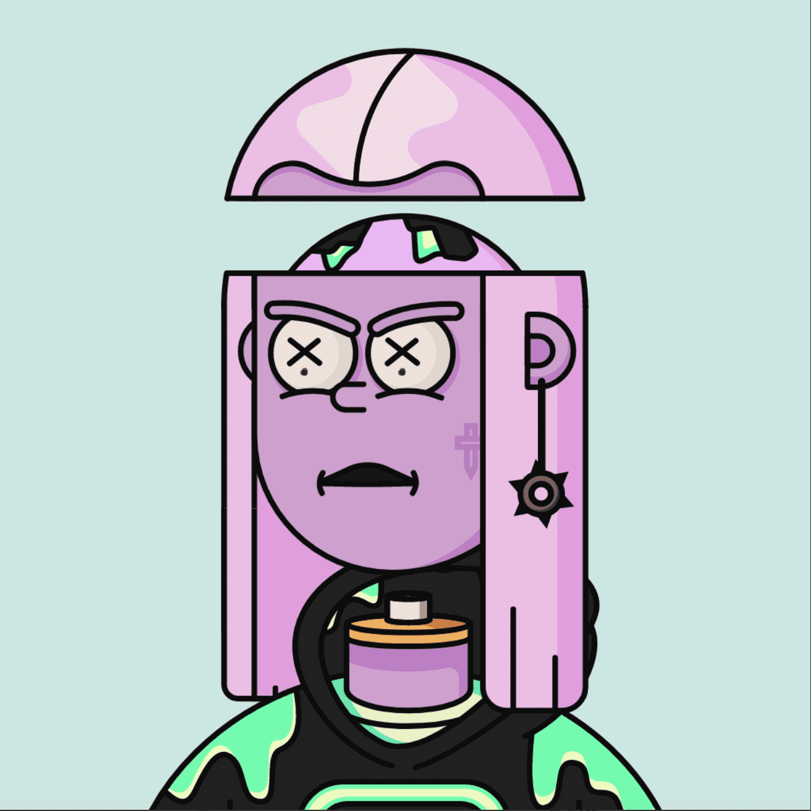

# The Possessed

Possessed NFT 在过去 7 天内售出 5932 次。The Possessed 的总销售额为 393 万美元。The Possessed NFT 的平均价格为 662 美元。共有 5,994 名拥有者，拥有 10,000 个代币的总供应量。

P4SD 实验室一直在对 10,000 名自愿的测试对象进行实验，以提高他们的创造力。不幸的是，实验导致了一个主要的副作用，成为附身！结果，每个对象都变得活跃起来，不断地在两种状态之间切换，祝福和附身。你可以将这个链上切换到你认为最能代表你的东西。

|||| 光敏性警告 |||| 以下内容可能会对有癫痫病史的人造成不良健康影响。建议谨慎...

