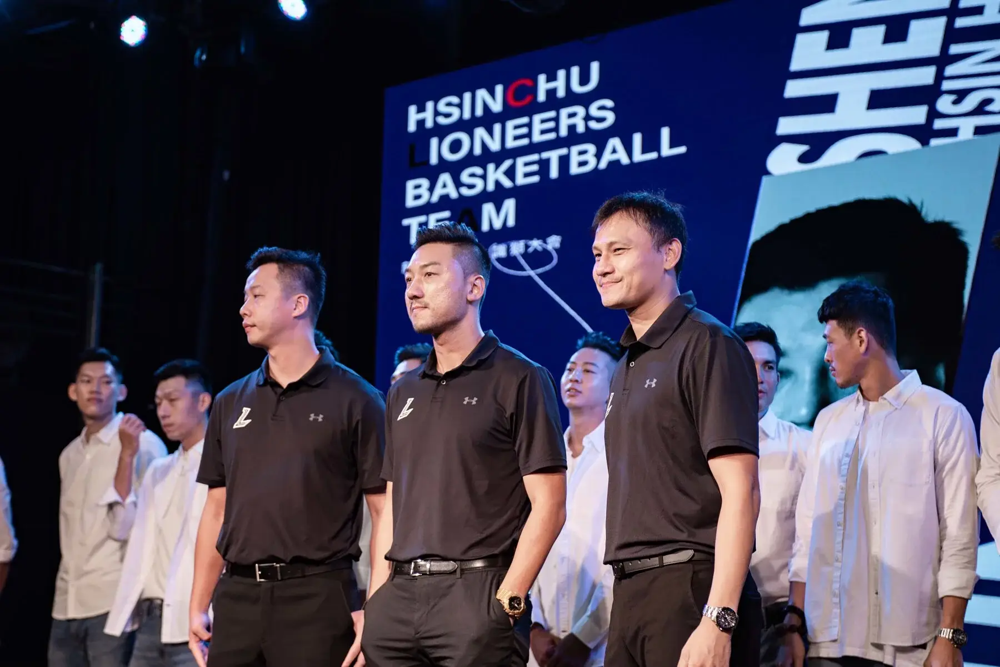

# JKOLioneersNFTv1

新竹街口攻城狮是一支台湾职业篮球队，以新竹县作为球队所在地，并以成员身份参与P. LEAGUE+（PLG）赛事。攻城狮成立于2020年，在2020–21年赛季成为P. LEAGUE+创始球队。球队主场为新竹县体育馆。

沒有什麼科技發展，是這座城市沒有貢獻過的。

沒有什麼事情，是這座城市沒有經歷過的。

沒有什麼風景，是這座城市沒有的。

 但要成為一座完美的城市，還需要一個令人驕傲的象徵，能夠將眾人的情感凝聚在一塊、結合文化脈絡與科技發展，體現新竹最引以為傲的價值。

 2020 年「 Hsinchu JKO Lioneers 新竹街口攻城獅職業籃球隊」由一群擁有竹科背景的企業家聯合成立，因彼此心中都有著對運動的熱愛齊聚一堂，希望藉由在地職業籃球隊的成軍，成為連結新竹的正向力量，投身職籃聯盟「P.LEAGUE ＋」。

 「新竹攻城獅」中文隊名靈感正是來自《宅男打籃球》的「竹北攻城獅」，我們血液裡不僅繼承竹科強韌的 DNA，也希望用「竹北攻城獅」隊長－老莫的精神提醒自己：「不論輸贏，全力打好每一球。」期望繼承新竹人、竹科的強韌意志，成為連結新竹的正向力量。

