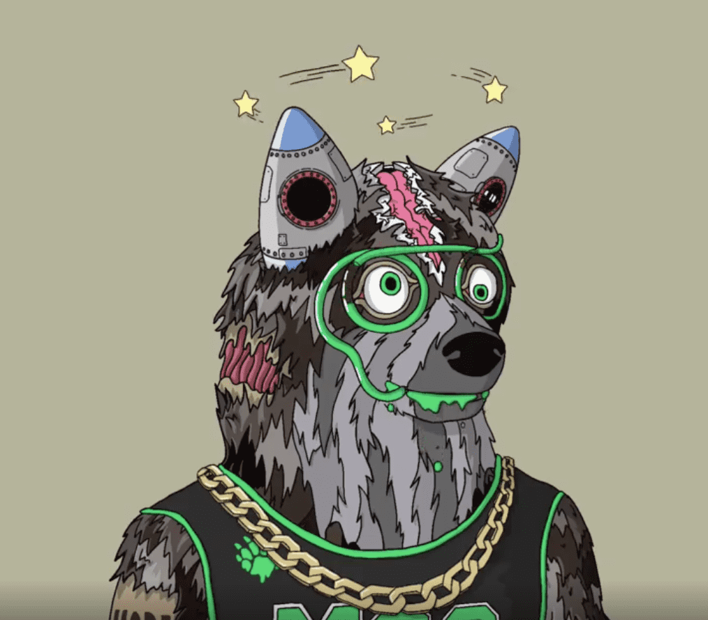

# Mutant Shiba Club

**突变芝巴俱乐部NFT统计**

创建于 6 个月前，4 代币供应，0% 费用

Mutant Shiba clubNFT NFT 在过去 7 天内售出 1 次。Mutant Shiba clubNFT 的总销售额为 215.45 美元。一个 Mutant Shiba clubNFT NFT 的平均价格为 215.5 美元。有 1 个 Mutant Shiba clubNFT 所有者，总共拥有 4 个代币。

Mutant Shiba clubNFT NFT - 常见问题（FAQ）
▶ 什么是 Mutant Shiba clubNFT？
Mutant Shiba clubNFT 是一个 NFT（Non-fungible token）集合。存储在区块链上的数字艺术品集合。
▶ Mutant Shiba clubNFT 代币有多少？
总共有 4 个 Mutant Shiba clubNFT NFT。目前 1 位所有者的钱包中至少有一个 Mutant Shiba clubNFT NTF。
▶ 什么是最昂贵的 Mutant Shiba clubNFT 销售？
最贵的 Mutant Shiba clubNFT NFT 是 Mutant Shiba Club。它于 2022 年 2 月 8 日（7 个月前）以 215.5 美元的价格售出。
▶ 最近卖出了多少 Mutant Shiba clubNFT？
过去 30 天内售出了 1 个 Mutant Shiba clubNFT NFT。

