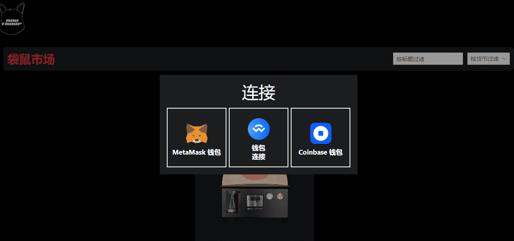

# Joey Mob

▶ 什么是乔伊暴徒？
Joey Mob 是一个 NFT（非同质代币）集合。存储在区块链上的数字艺术品集合。
▶ 有多少 Joey Mob 代币？
总共有 5,500 个 Joey Mob NFT。目前，1,313 位所有者的钱包中至少有一个 Joey Mob NTF。
▶ 最昂贵的 Joey Mob 销售是什么？
售出的最昂贵的 Joey Mob NFT 是 Joeybean Incubator #5351。它于 2022 年 6 月 21 日（2 个月前）以 329.3 美元的价格售出。
▶ 最近卖了多少 Joey Mob？
过去 30 天内售出了 303 个 Joey Mob NFT。
▶ Joey Mob 的成本是多少？
在过去 30 天里，Joey Mob NFT 最便宜的销售额低于 41 美元，最高销售额超过 88 美元。在过去 30 天内，Joey Mob NFT 的中位价格为 54 美元。

