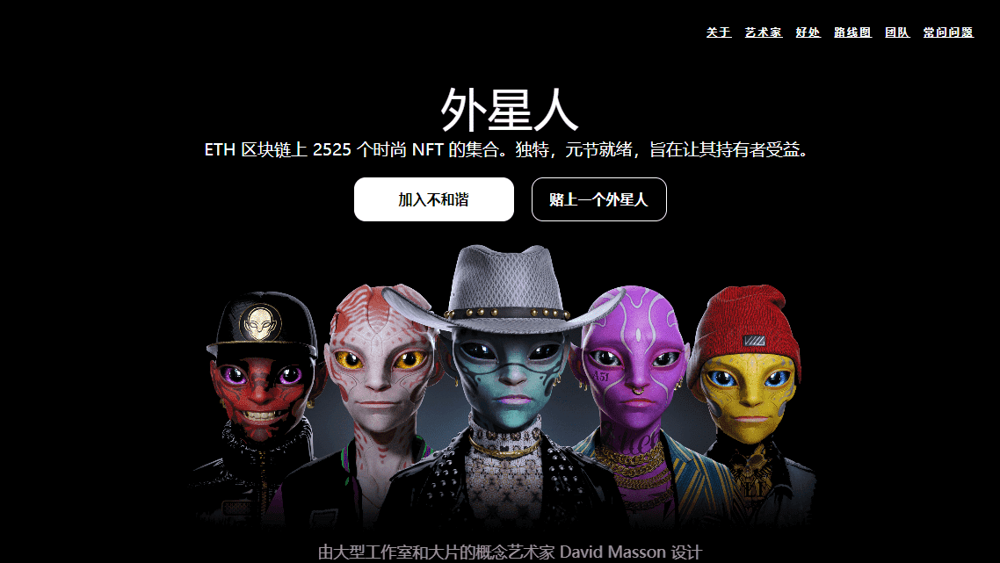

# Alienverse - NFT

Alienverse 是一个 NFT 集合，位于数字艺术和时尚的十字路口。David Masson San Gabriel 创作的 2525 件超逼真的 3D 艺术作品由 200 多个手工制作的特征组成。

David Masson San Gabriel 是一位西班牙裔美国艺术家，他帮助设计了业内一些最大的电影中最具标志性的角色、生物和服装的外观：Ready Player One、毒液、X 战警黑凤凰、黑衣人国际和屡获殊荣的系列 WandaVision。

在花了数年时间完善他的手艺之后，他现在正在利用自己的才能设计一个新的元宇宙就绪角色集合，称为 Alienverse，甚至可以与最大的 AAA 工作室相媲美。

