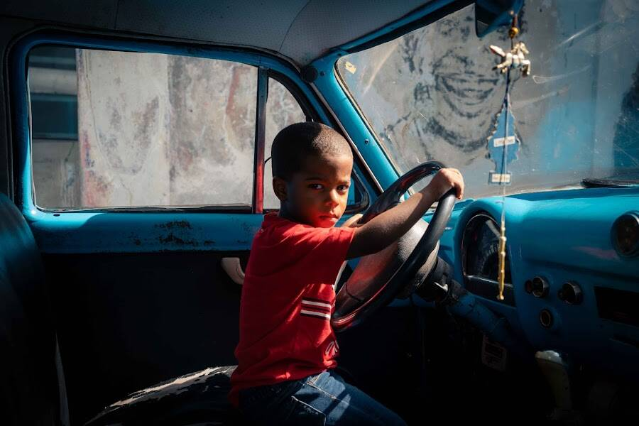

# Jonny Melon Editions

我于 2020 年 1 月访问了古巴，一个清晨，我带着相机在哈瓦那老城漫步。我的第一印象是古巴的一切似乎都慢了下来，就好像时间刚刚停止。

当我继续迷失在哈瓦那老城的迷宫中时，我遇到了这个小男孩，他坐在一辆老爷车的方向盘后面，假装开车，似乎对这个世界没有任何担忧。当我把相机从乘客窗口探出时，他好奇地盯着我的镜头筒，此时我拍下了这张照片。

有时在生活中，我们不知道我们要去哪里，也不确定明天会怎样。但从积极的角度来看，我们仍然在这个地球上，我们还在呼吸，我们今天可以选择创造魔法！

我认为重要的是要记住，无论我们处于人生的哪个阶段，我们都应该玩得开心，保持好奇，不要把生活看得太认真。

