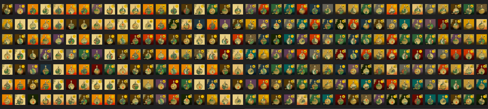

# Joocbox GowoonDar MBE

由韩国最优秀的酿酒大师、韩国代表性的高端传统白酒 Mungyeong Oh Minara Lee Jong-ki 的《Kowundal Master Blenders Edition》制作的白酒行业首个 NFT 由 NFT 出版。 Jukebox将NFT作为韩国代表性的传统文化内容发布，让韩国酒扩展到现实和虚拟世界、地球和太空。 传统酒是一种文化资产。 我们通过热爱酒精的人们的心将世界与世界连接起来。韩国第一酒 NFT 介绍 Master Blender JongKi Lee 的 Gowoon Dar Master Blender 版 NFT。 Joocbox 的 Operation NFT Liquor Project 将精神从现实带到虚拟世界，从地球到太空。 Joocbox 旨在通过酒类鉴赏家的热情连接不同的世界。

