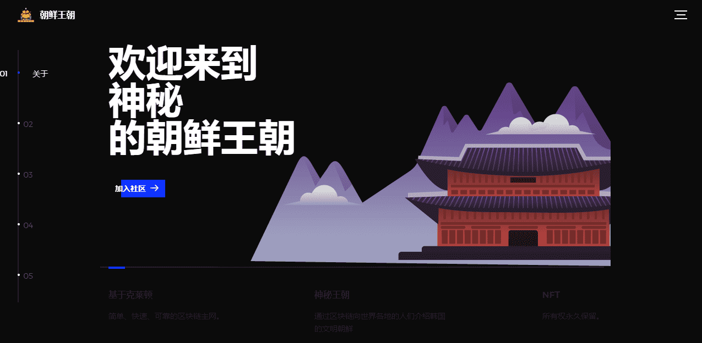

# Land : Joseon Dynasty

欢迎来到神秘的朝鲜王朝，如果在未来治理中确定了土地所有者资格，您可以在自己的土地上使用 JD People NFT 进行耕种。土地所有者也可以将土地借给佃农并从他们那里收税。土地分为三层，每层都有不同的提升百分比。Levels 中显示的 X 和 Y 值是治理中土地的坐标值。

基于克莱顿，简单、快速、可靠的区块链主网。神秘王朝通过区块链向世界各地的人们介绍韩国的文明朝鲜，NFT所有权永久保留。

