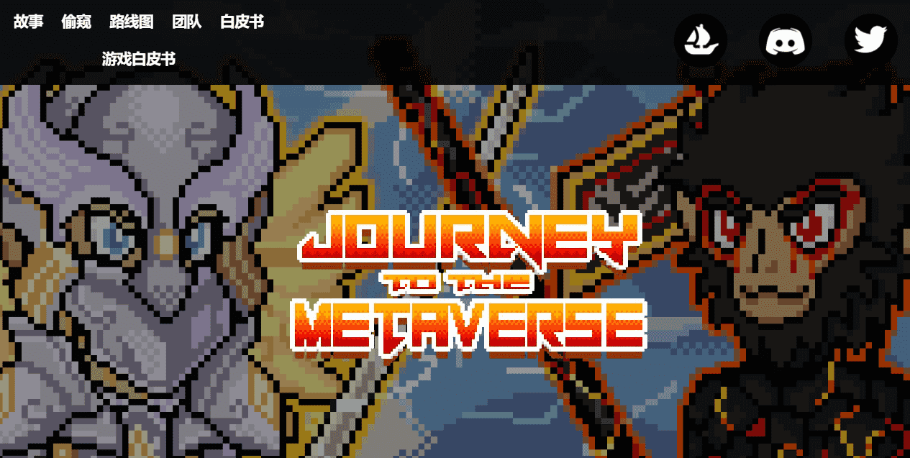

# Journey to the Metaverse - Genesis

这是一个社区驱动的项目，旨在扩大孙悟空的优势。现在加入，体验西游记孙悟空的第一个角色。第 2 代将在稍后放弃，最大供应量为 4444。

元界之旅，是4444位悟空从西游宇宙中的花果山故乡进入元界的合集。444 个 Wukong 的第一代创世系列目前正在进入元界，其余的将在以后进入。

《异界之旅》背后的理念，源于熊猫主人小时候对中国小说《西游记》的喜爱。没有一个项目是关于这样一个中国文化的故事。因此，我们决定创建一个项目，将其在 Metaverse 中变为现实，该项目将通过游戏和 pfp 将其变为现实。

